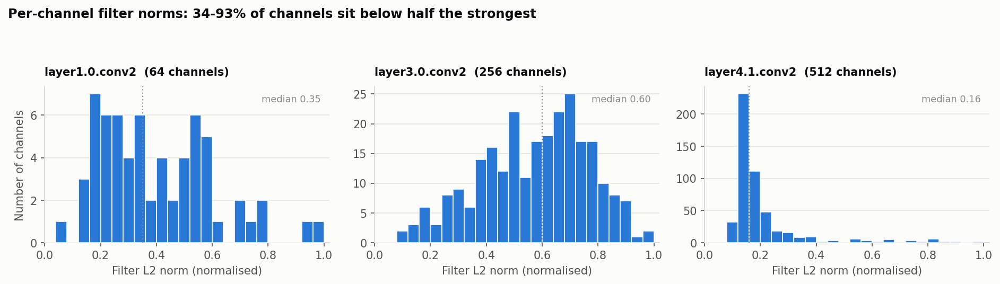
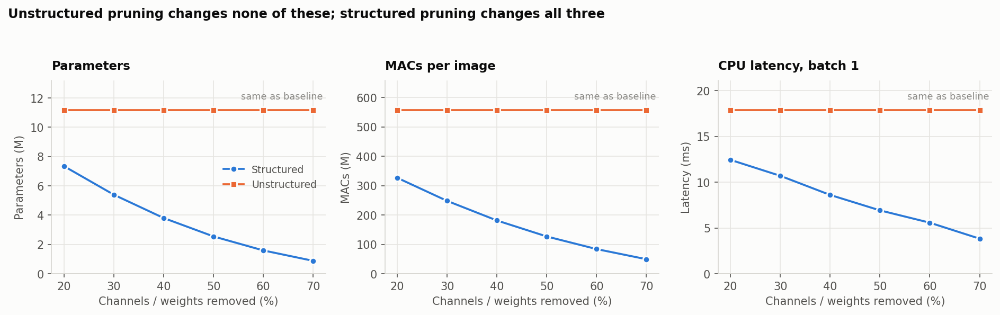
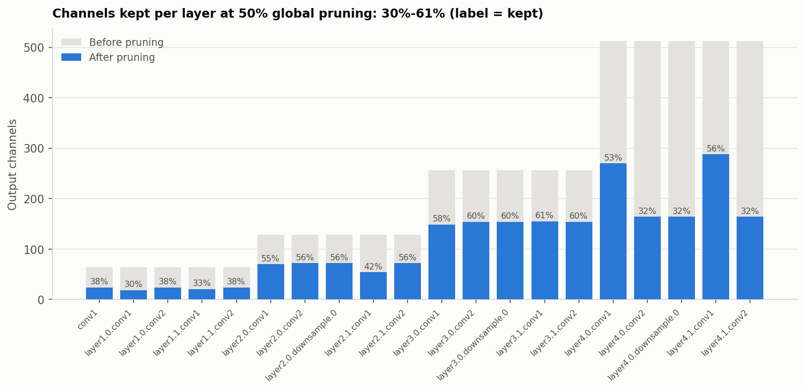
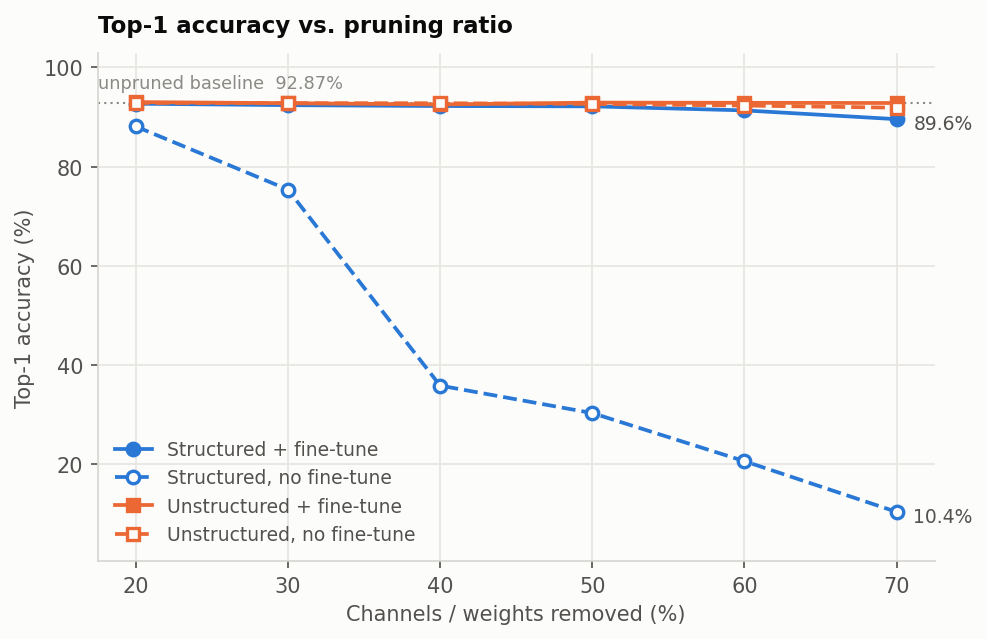
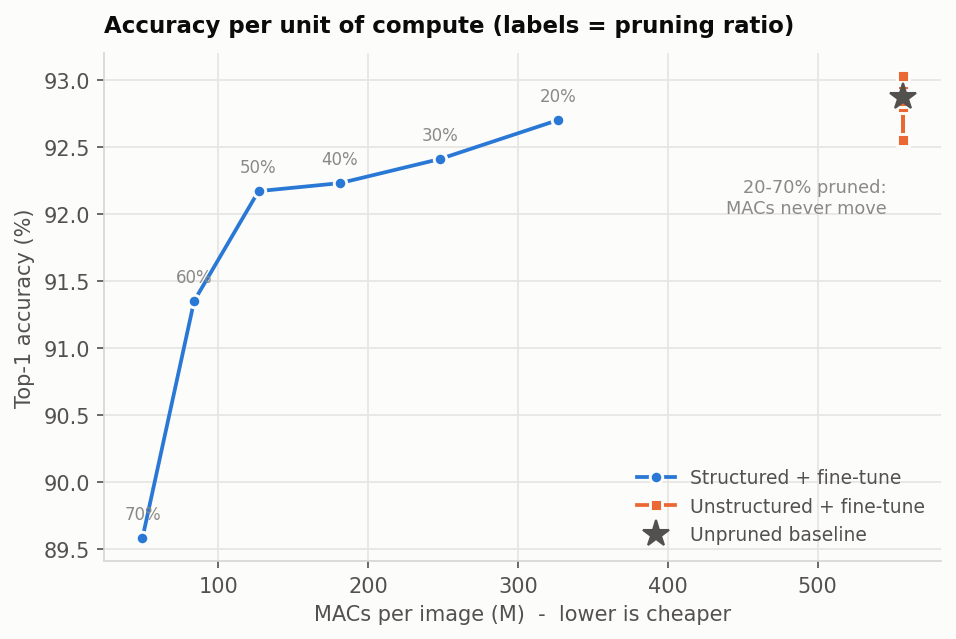

# Structured Pruning of a ResNet-18 with Torch-Pruning

> **Replication package.** The CIFAR-10 dataset is not included; it downloads automatically.
> To reproduce the experiment from scratch:
>
> ```bash
> pip install -r requirements.txt
> python scripts/train_baseline.py --epochs 30      # creates checkpoints/resnet18_cifar10.pt (CIFAR-10 downloads automatically)
> jupyter notebook notebooks/torch_pruning_beginner.ipynb   # prune + fine-tune, Steps 0-11
> # optional: python scripts/run_benchmark.py --finetune-epochs 3   # regenerates results/benchmark.csv (Step 10)
> # optional: python scripts/make_plots.py                          # regenerates results/figures/
> ```
>
> `results/benchmark.csv` is included only because Step 10 of the notebook reads it. Image links below point to
> `results/figures/`, which `make_plots.py` recreates.
g

**AIoT mid-term — Group 4**

A ResNet-18 trained on CIFAR-10, then cut down by 20–70% of its convolution channels
using [`torch_pruning`](https://github.com/VainF/Torch-Pruning), with every step measured.
The demo also shows the two things that make channel pruning interesting: why zeroing
weights buys you nothing on a real device, and why removing a channel from a residual
block breaks the network unless something tracks the dependencies for you.

> **Live demo:** `notebooks/torch_pruning_beginner.ipynb` — about 35 seconds of compute end to
> end on Colab, Apple MPS or plain CPU. It loads a pre-trained checkpoint, so none of the
> presentation is spent watching a model train.

<!-- HEADLINE:BEGIN -->
| | Baseline | Pruned 50% + fine-tune | Change |
|---|---|---|---|
| **Parameters** | 11.17 M | 2.55 M | **−77.2%** |
| **MACs** | 557 M | 127 M | **−77.2%** |
| **Top-1 accuracy** | 92.87% | 92.17% | **−0.70 pts** |
| Model size | 42.7 MB | 9.8 MB | −77.1% |
| CPU latency, batch 1 | 17.89 ms | 6.93 ms | **2.58× faster** |
| Activation memory | 7.06 MB | 3.04 MB | −57.0% |
<!-- HEADLINE:END -->

---

## What the demo shows

### 1. Deep networks carry redundant parameters

Measure the L2 norm of each convolution filter — how much each output channel
contributes — and many channels fall far below the strongest ones. In the last stage
(`layer4.1.conv2`), half of the 512 channels have a norm below 0.16 of the strongest
channel, while earlier layers are spread more widely (`layer3.0.conv2` has a median of
0.60). Channels with a very small norm produce near-constant feature maps that
downstream layers barely use.



### 2. Unstructured pruning: 50% of the weights, 0% of the cost

Fine-grained pruning ranks *individual weights* by magnitude and zeroes the smallest.
Accuracy holds up well, and nothing else changes: a `[64, 64, 3, 3]` kernel with half its
entries set to zero is still a `[64, 64, 3, 3]` kernel, and dense BLAS multiplies zeros at
full price. Parameters, MACs, latency and file size all stay exactly where they were.

It pays off only on a runtime with sparse-kernel support, which mobile and
microcontroller inference engines generally lack — irregular sparsity destroys the
memory-access patterns those kernels are built around.

### 3. Structured pruning: remove whole channels, and the shapes change

Deleting an entire output channel shrinks the tensor itself, so every metric moves at
once. The resulting model is an ordinary `nn.Module` that any runtime can execute with no
special support.

Because a convolution weight is `[out_channels, in_channels, k, k]` and channel pruning
shrinks *both* leading dimensions, the parameter count falls roughly with `(1 - ratio)²`.
Pruning 50% of the channels leaves about 25% of the parameters — a 4× reduction, not 2×.



### 4. Channel dependency: the reason this is hard

In a residual block the output of `conv2` is added to the identity shortcut:

```
x ──┬─────────────── conv1 ─ bn1 ─ relu ─ conv2 ─ bn2 ──┬── (+) ── relu ──▶
    │                                                   │
    └───────────────── identity shortcut ───────────────┘
```

Cut a channel *between* `conv1` and `conv2` and nothing outside the block notices — its
only consumers are `bn1`, the ReLU and `conv2`'s input.

Cut a channel on `conv2`'s **output** and the add has a 32-channel branch and a
64-channel shortcut:

```
RuntimeError: The size of tensor a (32) must match the size of tensor b (64)
              at non-singleton dimension 1
```

Section 4 of the notebook reproduces both cases.

### 5. How Torch-Pruning solves it

`DepGraph` ([Fang et al., CVPR 2023](https://openaccess.thecvf.com/content/CVPR2023/papers/Fang_DepGraph_Towards_Any_Structural_Pruning_CVPR_2023_paper.pdf))
runs one forward pass, records the autograd graph, and derives a dependency graph whose
edges read "cutting these channels here forces those channels there". Asking it about the
layer that just crashed returns the full group:

```
prune_out_channels   layer1.0.conv2          <-- naive pruning did this one
prune_out_channels   layer1.0.bn2            <-- and this one
prune_in_channels    layer1.1.conv1
prune_out_channels   layer1.1.bn2
prune_out_channels   layer1.1.conv2
prune_in_channels    layer2.0.conv1
prune_in_channels    layer2.0.downsample.0
prune_out_channels   bn1
prune_out_channels   conv1
prune_in_channels    layer1.0.conv1
```

Ten layers, spanning two stages and the stem, because the shortcut traces all the way
back to the first convolution. The hand-written attempt handled two of them.

Since the graph comes from tracing rather than from a hard-coded list of architectures,
the same code path handles residuals, concatenations, grouped convolutions and
transformers.

The grouping is visible in the result. Pruning 50% globally does not remove 50% from every
layer — layers keep between 30% and 61% of their channels,
depending on where the redundancy is — but layers that share a residual stream come out at
*exactly* the same width, because the dependency graph will not let them differ:



`layer4.0.conv2`, `layer4.0.downsample.0` and `layer4.1.conv2` all keep 29%. They are one
group. The stage-3 layers keep 61% — and the filter-norm histogram above says why: stage 4
is where the near-zero channels are.

---

## Results

<!-- RESULTS:BEGIN -->
| Model                |   Accuracy (%) |   vs base (pts) |   Params (M) |   MACs (M) |   Size (MB) |   CPU lat (ms) |   Speed-up |
|:---------------------|---------------:|----------------:|-------------:|-----------:|------------:|---------------:|-----------:|
| ResNet18 baseline    |          92.87 |            0    |        11.17 |        557 |        42.7 |          17.89 |       1    |
| unstructured 20%     |          92.86 |           -0.01 |        11.17 |        557 |        42.7 |          17.89 |       1    |
| unstructured 20% +ft |          93.03 |            0.16 |        11.17 |        557 |        42.7 |          17.89 |       1    |
| structured 20%       |          88.12 |           -4.75 |         7.34 |        327 |        28.1 |          12.45 |       1.44 |
| structured 20% +ft   |          92.7  |           -0.17 |         7.34 |        327 |        28.1 |          12.45 |       1.44 |
| unstructured 30%     |          92.8  |           -0.07 |        11.17 |        557 |        42.7 |          17.89 |       1    |
| unstructured 30% +ft |          92.8  |           -0.07 |        11.17 |        557 |        42.7 |          17.89 |       1    |
| structured 30%       |          75.39 |          -17.48 |         5.39 |        248 |        20.6 |          10.7  |       1.67 |
| structured 30% +ft   |          92.41 |           -0.46 |         5.39 |        248 |        20.6 |          10.7  |       1.67 |
| unstructured 40%     |          92.79 |           -0.08 |        11.17 |        557 |        42.7 |          17.89 |       1    |
| unstructured 40% +ft |          92.55 |           -0.32 |        11.17 |        557 |        42.7 |          17.89 |       1    |
| structured 40%       |          35.86 |          -57.01 |         3.8  |        181 |        14.6 |           8.61 |       2.08 |
| structured 40% +ft   |          92.23 |           -0.64 |         3.8  |        181 |        14.6 |           8.61 |       2.08 |
| unstructured 50%     |          92.65 |           -0.22 |        11.17 |        557 |        42.7 |          17.89 |       1    |
| unstructured 50% +ft |          92.92 |            0.05 |        11.17 |        557 |        42.7 |          17.89 |       1    |
| structured 50%       |          30.32 |          -62.55 |         2.55 |        127 |         9.8 |           6.93 |       2.58 |
| structured 50% +ft   |          92.17 |           -0.7  |         2.55 |        127 |         9.8 |           6.93 |       2.58 |
| unstructured 60%     |          92.33 |           -0.54 |        11.17 |        557 |        42.7 |          17.89 |       1    |
| unstructured 60% +ft |          92.88 |            0.01 |        11.17 |        557 |        42.7 |          17.89 |       1    |
| structured 60%       |          20.62 |          -72.25 |         1.59 |         84 |         6.1 |           5.58 |       3.21 |
| structured 60% +ft   |          91.35 |           -1.52 |         1.59 |         84 |         6.1 |           5.58 |       3.21 |
| unstructured 70%     |          91.89 |           -0.98 |        11.17 |        557 |        42.7 |          17.89 |       1    |
| unstructured 70% +ft |          92.84 |           -0.03 |        11.17 |        557 |        42.7 |          17.89 |       1    |
| structured 70%       |          10.39 |          -82.48 |         0.88 |         50 |         3.4 |           3.83 |       4.67 |
| structured 70% +ft   |          89.58 |           -3.29 |         0.88 |         50 |         3.4 |           3.83 |       4.67 |




<!-- RESULTS:END -->

### How each number is measured

| Metric | Method |
|---|---|
| Parameters | `sum(p.numel() for p in model.parameters())` — stored parameters, zeros included |
| MACs | `torch_pruning.utils.count_ops_and_params`, on CPU, input `1×3×32×32` |
| Accuracy | Top-1 on the CIFAR-10 test set (10,000 images for the committed results) |
| CPU latency | Batch-1 forward passes under `torch.inference_mode()`. 9 blocks of 60 timings; the fastest block's median is reported, because timing noise on a shared machine only ever adds time |
| Model size | Serialised `state_dict` written to disk, in MiB — the Flash footprint |
| Activation memory | Sum of all leaf-module output tensors in one batch-1 forward pass — the RAM inference needs on top of the weights |

Channel selection uses group L2 magnitude (`GroupMagnitudeImportance(p=2)`), which scores
a whole dependency group rather than one layer, with global ranking across the network.
The classifier is excluded from pruning so the model keeps its ten output classes.

The 25 rows below share seven distinct architectures — zeroing weights changes no tensor
shape, so the baseline and all twelve unstructured variants compute exactly the same
thing, and fine-tuning changes values rather than shapes. Latency is therefore measured
once per architecture and shared, rather than 25 times; re-timing identical networks
produced spreads of up to 15% from nothing but machine drift.

---

## Repository layout

```
notebooks/torch_pruning_beginner.ipynb   the live demo — start here
src/
  config.py      paths, device selection, seeds
  data.py        CIFAR-10 loaders, class-balanced test subset
  model.py       ResNet-18 with a CIFAR stem
  engine.py      train / evaluate / fine-tune loops
  metrics.py     parameters, MACs, latency, size, activation memory
  pruning.py     unstructured, naive structured (the broken one), DepGraph structured
scripts/
  train_baseline.py   trains the checkpoint the demo loads
  run_benchmark.py    full sweep, 4 variants × 6 ratios → results/
  make_plots.py       figures for the slides
tests/test_smoke.py   pytest, no dataset needed
results/              benchmark.csv, benchmark.md, figures/
checkpoints/          the trained baseline
```

---

## Running it

### Colab

Open `notebooks/torch_pruning_beginner.ipynb` in Colab and run all cells. The first cell
clones this repository and installs `torch-pruning`; nothing else is needed.

### Locally

```bash
pip install -r requirements.txt
jupyter notebook notebooks/torch_pruning_beginner.ipynb
```

The notebook picks CUDA, then MPS, then CPU, whichever it finds first. CIFAR-10 downloads
on first use (170 MB) — do that before presenting.

### Reproducing the benchmark

```bash
python scripts/train_baseline.py --epochs 30            # 68 min on Apple MPS -> 93.20%; 28 mins on Colab T4
python scripts/run_benchmark.py --finetune-epochs 3    # 66 min; 
python scripts/run_benchmark.py --latency-only \
    --latency-runs 60 --latency-repeats 9              # 2 min, machine idle
python scripts/make_plots.py
```

The latency pass is separate on purpose: timings taken while the sweep is fine-tuning on
the GPU came out up to 15% apart for networks that were byte-identical. Latency depends
only on architecture, and every architecture in the sweep is reproducible from the
baseline plus a ratio, so re-timing them on an idle machine costs two minutes and does
not touch the accuracies.

`run_benchmark.py` writes `results/benchmark.csv` after every ratio, so an interrupted run
still leaves usable data. Useful flags: `--ratios 0.4 0.5 0.6`, `--skip-finetune`,
`--uniform-pruning` (same ratio in every layer instead of global ranking),
`--eval-subset 2000`.

### Tests

```bash
pytest -q
```

Sixteen checks covering the pruning code, including that unstructured pruning leaves
MACs untouched, that naive pruning of a block output raises `RuntimeError`, and that the
dependency group spans the stem and the next stage's downsample shortcut. They run on
random tensors, so no dataset download is required.

---

## Where structured pruning stops

Pruning removes channels; it does not change the number of bits per weight. On a
microcontroller the usual pipeline is pruning *then* INT8 quantisation, and the two
compose — roughly 4× from pruning at 50%, another 4× from quantisation.

---

## References

- Fang, Ma, Song, Mi, Wang — *DepGraph: Towards Any Structural Pruning*, CVPR 2023.
  [PDF](https://openaccess.thecvf.com/content/CVPR2023/papers/Fang_DepGraph_Towards_Any_Structural_Pruning_CVPR_2023_paper.pdf)
- [`VainF/Torch-Pruning`](https://github.com/VainF/Torch-Pruning)
- Arik Poznanski, [*Neural Network Pruning: How to Accelerate Inference with Minimal Accuracy Loss*](https://arikpoz.github.io/posts/2025-04-10-neural-network-pruning-how-to-accelerate-inference-with-minimal-accuracy-loss/), 2025
